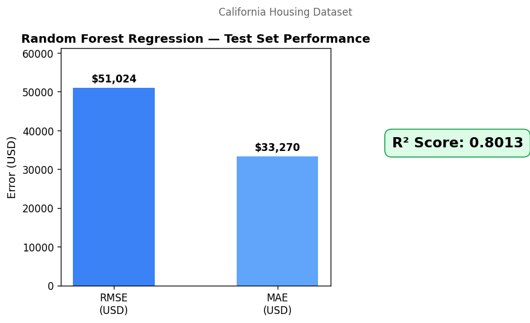
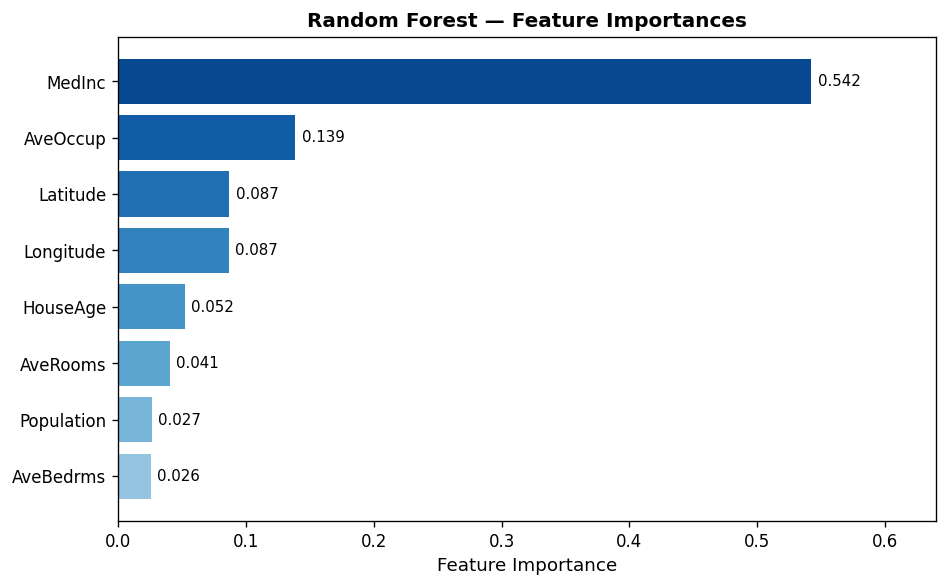
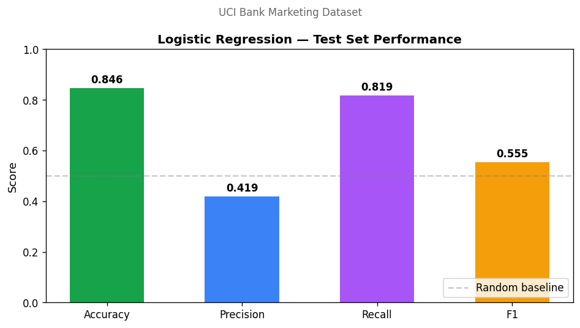
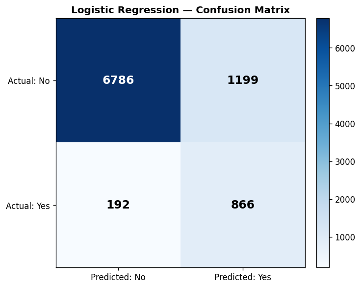

# Prologis Financial Assistant

End-to-end AI-powered Financial Assistant Web Application for **Prologis (NYSE: PLD)**, a global industrial real estate investment trust. The platform combines structured data querying, classic machine learning (regression and classification), and generative AI to retrieve financial and property insights, perform predictive analytics, and provide natural-language summaries.

Built as a multi-cloud system: Postgres for structured data, AWS SageMaker for ML model hosting, Google Gemini (with function calling) for the conversational agent, and AWS Bedrock (Claude Haiku) for summarization.

---

## Architecture

```
                        ┌─────────────────────────────────────────────┐
                        │        Streamlit Web App (Frontend)         │
                        │  💬 Chat   📊 Data Browser   🤖 ML Tab      │
                        └──────┬──────────┬──────────────┬────────────┘
                               │          │              │
                ┌──────────────┴──┐    ┌──┴──────┐   ┌───┴──────────────┐
                │  Gemini Agent   │    │ Postgres│   │ AWS SageMaker    │
                │  (function      │    │ (props +│   │  • RF Regressor  │
                │   calling)      │    │ financs)│   │  • LR Classifier │
                └────┬───┬───┬────┘    └─────────┘   └──────────────────┘
                     │   │   │
        ┌────────────┘   │   └──────────────┐
        ▼                ▼                  ▼
  ┌──────────┐     ┌──────────┐      ┌────────────────┐
  │ SEC EDGAR│     │  Press   │      │  AWS Bedrock   │
  │  (10-K,  │     │ Releases │      │ (Claude Haiku, │
  │  10-Q)   │     │  (JSON)  │      │ summarization) │
  └──────────┘     └──────────┘      └────────────────┘
```

**Cloud services used:**
- **Google Gemini 2.5 Flash** — agent reasoning + function calling (AI Studio API)
- **AWS SageMaker** — hosted endpoints for the regression and classification models
- **AWS Bedrock** — Claude Haiku 4.5 for press-release summarization (multi-cloud requirement)

---

## Data sources

| Source | Format | Records | Purpose |
|---|---|---|---|
| **SEC EDGAR** | JSON (XBRL company facts API) | Latest 10-K/10-Q metrics | Authoritative financial data: revenue, net income, operating expenses, total assets/liabilities |
| **Postgres** | `properties` + `financials` tables | 20 properties across 9 US metros | Property-level revenue/expense queries |
| **Press releases** | JSON | 10 mocked Prologis releases | Acquisitions, expansions, earnings, sustainability announcements |

The 20 sample properties span Los Angeles, Chicago, New York, Kansas City, Dallas, Miami, Seattle, Phoenix, Portland, Philadelphia, and Atlanta, with mixed Industrial / Logistics / Warehouse types.

---

## Repository layout

```
financial-assistant/
├── agent/
│   ├── tools.py            # 3 tool functions exposed to Gemini
│   ├── bedrock.py          # AWS Bedrock summarization helper
│   └── agent.py            # Gemini agent with function calling
├── app/
│   └── streamlit_app.py    # 3-tab Streamlit frontend
├── data/
│   ├── press_releases.json # 10 mocked press releases
│   └── sec/                # cached SEC EDGAR responses
├── db/
│   ├── schema.sql          # properties + financials tables
│   └── seed.sql            # 20 sample properties + financials
├── ml/
│   ├── regression/         # California Housing → Random Forest
│   │   ├── train.py
│   │   ├── inference.py    # SageMaker inference handler
│   │   └── metrics.json
│   ├── classification/     # UCI Bank Marketing → Logistic Regression
│   │   ├── train.py
│   │   ├── inference.py
│   │   └── metrics.json
│   └── plots/              # rendered metric/feature plots
├── scripts/
│   ├── fetch_sec.py        # pull SEC EDGAR data
│   ├── deploy_sagemaker.py # deploy both endpoints
│   ├── delete_endpoints.py # cleanup
│   └── generate_plots.py   # render evaluation plots
├── requirements.txt
└── .env.example
```

---

## Setup

### Prerequisites

- macOS / Linux with Python 3.9 (the SageMaker sklearn 1.2-1 container expects 3.9 — using a matching local env avoids pickle compatibility issues)
- Postgres 15+
- AWS account with Bedrock and SageMaker access
- Google AI Studio API key

### Local environment

```bash
# Clone and enter the project
git clone https://github.com/RahulNayak704/prologis-financial-assistant.git
cd prologis-financial-assistant

# Conda env with Python 3.9 to match SageMaker container
conda create -n smpy39 python=3.9 -y
conda activate smpy39

pip install -r requirements.txt
```

### Postgres

```bash
brew install postgresql@15
brew services start postgresql@15
createdb financial_assistant
psql -d financial_assistant -c "CREATE USER postgres WITH SUPERUSER PASSWORD 'postgres';"
psql -h localhost -U postgres -d financial_assistant -f db/schema.sql
psql -h localhost -U postgres -d financial_assistant -f db/seed.sql
```

Verify with `psql -h localhost -U postgres -d financial_assistant -c "SELECT COUNT(*) FROM properties;"` — should return `20`.

### Environment variables

```bash
cp .env.example .env
# Then edit .env to fill in your real values:
#   GEMINI_API_KEY    — from https://aistudio.google.com/apikey
#   AWS_ACCESS_KEY_ID, AWS_SECRET_ACCESS_KEY, AWS_REGION
#   SAGEMAKER_BUCKET, SAGEMAKER_ROLE_ARN
```

### SEC data

```bash
# First edit scripts/fetch_sec.py to put your real email in the User-Agent
python scripts/fetch_sec.py
```

This populates `data/sec/prologis_financials.json` with the latest annual + quarterly metrics from the SEC company facts API.

---

## Machine learning models

### Regression — Random Forest on California Housing

**Dataset:** California Housing (`sklearn.datasets.fetch_california_housing`) — 20,640 samples, 8 numeric features. Target: median house value (in 100k USD).

**Pipeline:** `StandardScaler` → `RandomForestRegressor(n_estimators=100, max_depth=15, min_samples_split=5)`.

**Train + evaluate locally:**
```bash
python ml/regression/train.py
```

**Test set metrics:**
| Metric | Value |
|---|---|
| RMSE | $51,024 |
| MAE | $33,270 |
| R² | 0.8014 |



The most important features are median income (54.2%), average occupancy (13.9%), and latitude/longitude (~17% combined) — geographically and economically intuitive.



### Classification — Logistic Regression on UCI Bank Marketing

**Dataset:** UCI Bank Marketing (45,211 records, 16 features). Binary target: did the customer subscribe to a term deposit (yes/no). The dataset is highly imbalanced (~88% no, 12% yes) so the model is trained with `class_weight="balanced"` to prioritize recall.

**Pipeline:** `ColumnTransformer(StandardScaler on numerics, OneHotEncoder on categoricals)` → `LogisticRegression(class_weight="balanced", max_iter=1000)`.

**Train + evaluate locally:**
```bash
python ml/classification/train.py
```

**Test set metrics:**
| Metric | Value |
|---|---|
| Accuracy | 0.846 |
| Precision | 0.419 |
| Recall | 0.819 |
| F1 | 0.555 |



The confusion matrix shows the recall–precision trade-off: the model captures **819 of 1,058 actual subscribers** (high recall) at the cost of more false positives. For a bank marketing context — where calling extra prospects is cheap but missing a real subscriber is costly — this is the right trade-off.



### Deployment to SageMaker

```bash
python scripts/deploy_sagemaker.py
```

This script:
1. Tarballs each `model.joblib` to S3
2. Creates a SageMaker `SKLearnModel` for each, pointing to the local `inference.py` as `source_dir` (the SDK uploads it and configures the container automatically)
3. Deploys to `ml.t2.medium` instances using the `1.2-1` sklearn framework container (Python 3.9, sklearn 1.2.x)
4. Auto-populates `SAGEMAKER_REGRESSION_ENDPOINT` and `SAGEMAKER_CLASSIFICATION_ENDPOINT` in `.env`

Total deploy time: ~12 minutes for both endpoints.

**Endpoints can be invoked from any code with `boto3.client('sagemaker-runtime').invoke_endpoint(...)` and accept JSON.** Both inference scripts (`ml/*/inference.py`) implement the standard SageMaker contract: `model_fn`, `input_fn`, `predict_fn`, `output_fn`.

To clean up after the demo:
```bash
python scripts/delete_endpoints.py
```

---

## Conversational agent

The agent is built using Google's Generative AI SDK (Gemini 2.5 Flash) with function calling. The same agent pattern (tool declaration, function calling, multi-turn orchestration) is used by Vertex AI ADK; this implementation is portable to Vertex AI by swapping the client initialization.

### Tools available to the agent

| Tool | Purpose | Backed by |
|---|---|---|
| `query_postgres(metro_area, property_type, min_revenue)` | Filter properties + financials | Postgres |
| `query_sec_edgar(metric, period)` | Look up Prologis revenue, net income, etc. | SEC EDGAR JSON cache |
| `query_press_releases(keywords, category)` | Search press releases by topic | JSON store |
| `summarize_with_bedrock(text, max_words)` | Condense long text to N words | **AWS Bedrock (Claude Haiku 4.5)** ← multi-cloud |

### How the agent routes a query

1. User asks a natural-language question in the Chat tab
2. Gemini reads the question and the registered tool schemas
3. The model emits one or more `function_call` blocks naming the tool and arguments
4. The orchestrator (`agent/agent.py`) executes each tool locally and feeds results back
5. Gemini composes a final natural-language answer grounded in the returned data
6. Up to 6 turns of tool-calling are supported (handles multi-source questions)

### Example traces

| Query | Tools called |
|---|---|
| *"What was Prologis' net income last year?"* | `query_sec_edgar(metric="net_income", period="annual")` |
| *"Show industrial properties in Chicago with revenue."* | `query_postgres(metro_area="Chicago", property_type="Industrial")` |
| *"Did Prologis announce any acquisitions recently?"* | `query_press_releases(category="acquisition")` |
| *"Summarize the most recent earnings press release."* | `query_press_releases(category="earnings")` → `summarize_with_bedrock(...)` |
| *"Compare property revenues between Dallas and Phoenix."* | `query_postgres(metro_area="Dallas")` → `query_postgres(metro_area="Phoenix")` |

The Streamlit Chat tab shows a "🔧 Tools used" expander under each response, displaying which tools fired and what they returned — useful for transparency and debugging.

---

## Running the app

```bash
streamlit run app/streamlit_app.py
```

The app has three tabs:

- **💬 Chat** — natural-language Q&A backed by the Gemini agent
- **📊 Data** — Properties (Postgres dataframe with metro/type filters), SEC Filings (latest annual values), Press Releases (expandable list)
- **🤖 ML Predictions** — Sliders/dropdowns that POST to the live SageMaker endpoints and display predictions in real time

---

## Multi-cloud summary

| Cloud | Service | Component |
|---|---|---|
| **GCP** | Gemini 2.5 Flash (AI Studio) | Conversational agent / function-calling orchestrator |
| **AWS** | SageMaker | Two hosted ML endpoints (regression + classification) |
| **AWS** | Bedrock (Claude Haiku 4.5) | Press-release summarization |
| **AWS** | S3 | Model artifact storage |
| **AWS** | IAM | SageMaker execution role + CLI user |
| **Local** | Postgres 15 | Properties + financials |

The cross-cloud design is functional, not just decorative: queries that need a press release summary call **Bedrock**, predictions go to **SageMaker**, agent reasoning happens in **Gemini**.

---

## Known limitations

- The Postgres seed is synthetic (revenue/net-income figures scaled from square footage with noise) — the SEC EDGAR data is real
- Press releases are mocked (the assignment explicitly allows this); real Prologis press releases would be obtained via Investor Relations RSS or scraping
- The SageMaker container is constrained to sklearn 1.2.x and Python 3.9 (the latest version AWS publishes); the local training env mirrors these versions to keep pickle formats compatible
- Bedrock model availability is region-specific; the project uses the `us-east-1` cross-region inference profile for Claude Haiku 4.5
